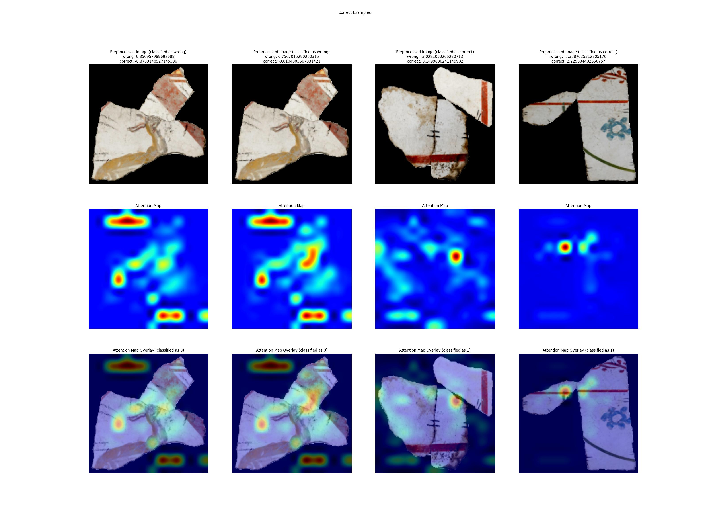
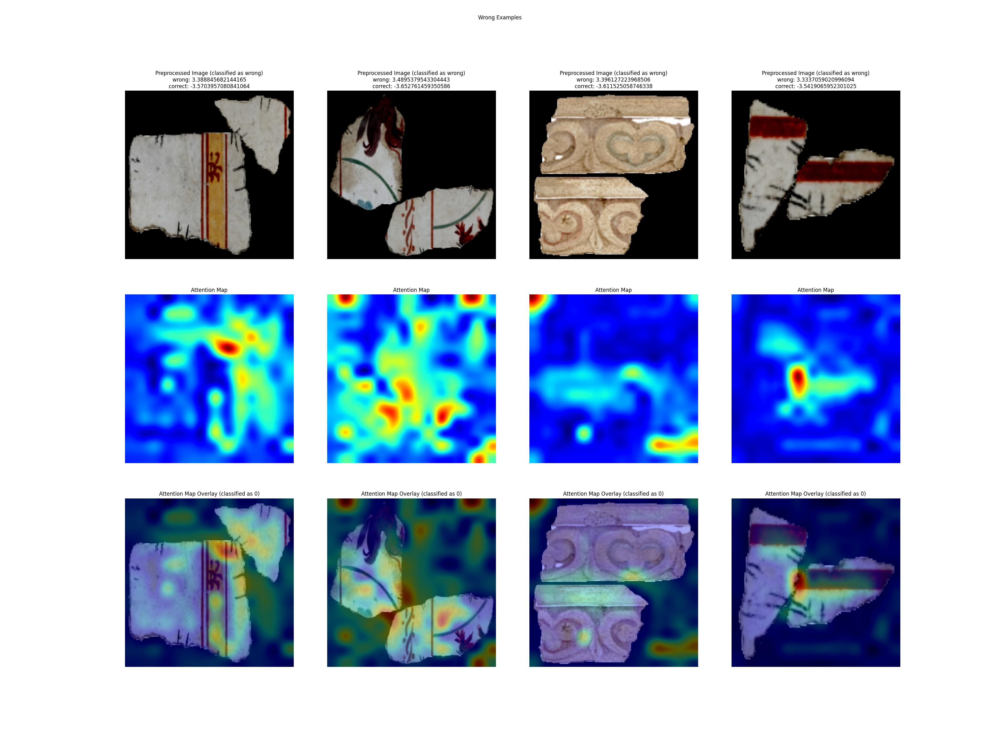

# Learning to discriminate Pairwise Alignment

The repository contains the code for training and inference of the Pairwise Alignment Discriminator (PAD), which is a network trained to assign a score to two irregular fragments aligned. 
Inspired by [JigsawNet](https://github.com/Lecanyu/JigsawNet), the objective is to create a more *general* system, capable of assessing even *imperfect* alignments (for example, when dealing with eroded real archeological fragments) or alignments which looks unlikely, so we rely less on specific cues or perfect fits and more on the *good continuation* from a visual point of view.

To do this, we cannot rely uniquely on one set of features, so we trained the network on a series of correct and wrong matches. The first version of this discriminator uses a binary classification head (therefore *discriminator*) as it is the simplest (and sometimes most effective) way to score an alignments. 

The question is: can the discriminator learn how to distinguish a *correct* alignment from a *wrong* one? And how are we to understand if it actually learned something or it just found a trick/shortcut for the classification.

One important aspect of the training network is the data, which for these experiments is taken from the RePAIR dataset ([webpage](https://repairproject.github.io/RePAIR_dataset/), [data](https://zenodo.org/records/13993089), [paper](https://arxiv.org/abs/2410.24010)). 
The general idea is that we take a pair of aligned fragments and consider them as a *correct* example, and we take *any* (later more details on this) other example of an aligned pair which is not the correct one as a *bad* example. We created several versions of the dataset, by first taking just *wrong* examples, and later going to carefully choose the *hard* negatives, examples in which the alignment looks plausible, but it is indeed not correct. For example, examples in which the color is similar, or the shape is fitting, but the overall fit (due to the mixture of shapes, pictorial cues, drawings, color, ecc) showed (to a human expert) that this is not the correct alignment.

Some of the choices in the architecture were taken with the objective of incorporating the discriminator (initially the binary classification, later the confidence or a more sophisticated score between 0 and 1) inside [a puzzle solving framework](https://github.com/RePAIRProject/RL_puzzle_solver) to reassemble broken artworks.

## Details

Here more details on the process, the model architecture and the data

### Process and Considerations
During the process there were many iterations between fixing/improving the dataset and the code, the most important points to recall could be:
- Data played a major role, improving the dataset helped a lot for performance and robustness.
- When we exagerated with manually chosen data, performance started dropping again. It is important to have a consistent and careful way to produce reliable data.
- Pre and post processing (transformation, standardization, data augmentation) are key component for reaching high accuracy.
- Training from scratch was not possible with our dataset (from 5k to 20k images depending on the inclusion of more or less examples), or at least it did not reach the level of accuracy of pre-trained large models, so fine-tuning a large model was by far the best result. 
- Training for a small number of epochs 20-25 epochs seemed to be enough (also avoid overfitting on small batches of data). 

### Code and Models

The code uses the `transformers` library to fine-tune a `ViTForImageClassification` model for binary classification. 
The code is relatively straightforward, a few important points:
- We used as a pre-trained model the `google/vit-base-patch16-224-in21k` model, as it seemed to outperform all other ones. THe same `google/vit` large model performed worse, and even trying `dinov2`-based models and `timm`-based models (which, btw, used much more memory and much larger size, so also more computationally intensive when doing inference) did not help, the `base-patch16-224` models stood out as a pre-trained backbone.
- VLM models (using refined prompts) did not help, yet this was to be expected as the data relates to the archeological context, so less *natural* and most likely much less present in *standard* databases for pre-training large models.
- Using `albumentations` helped, since the alignments requires some kind of *spatial* reasoning, geometric augmentations were helpful (or `albumentationsx` if you wish, did not notice major changes apart from license for our case, but it seems that the new version `x` has more powerful features, both can be used with this project)
- Visualizing attention maps has been helpful to check what the network *sees* (although we are aware that it is not the same as for humans) and to check the most important areas of the image when discriminating alignments.

### Data

The data comes from the RePAIR dataset ([webpage](https://repairproject.github.io/RePAIR_dataset/), [data](https://zenodo.org/records/13993089), [paper](https://arxiv.org/abs/2410.24010)). 
We post processed the data to create *alignments* of pairs of pieces. This gives us a dataset (which is not public at the moment, but it is just a re-combination of images from the publicly available one - and in case of curiosity, drop me a mail) for *correct* and *wrong* alignemnts. 
The correct example are 4507 and more than 15000 wrong alignments were created (not always used all of them).

The initial version was very basic, the second and third one were better and more precise.

| Dataset | Total size (images) | Train | Validation | Test |
|:--------|:-------:|:-------:|:-------:|:-------:|
| V2 | 9977 | 6897 (69.13%) | 1000 (10.02%) | 2080 (20.85%) |
| V3 | 22632 | 15645 (69.13%) | 1737 (7.67%) | 5250 (23.20%) |

### Benchmark

Quickly some numbers if you are curious:

| Model | eval_loss | eval_accuracy | eval_precision | eval_recall | eval_f1 | eval_runtime | eval_samples_per_second | eval_steps_per_second | 
|:----|:---:|:---:|:---:|:---:|:---:|:---:|:---:|:---:|:---:|
| ViT-fast_224 | 0.165 | 0.960 | 0.960 | 0.960 | 0.960 | 32.820 | 52.925 | 0.853 |

#### Attention Maps

| Correct Alignments | Wrong Alignments |
|:--------:|:--------:|
|||
Interestingly, it seems not to be completely deterministic, as the two attention maps on the same scene look slightly different (see on the first two randomly chosen samples for *correct* alignments).

