# Results

Keeping track of the results of the quick attempts (using AI-enabled auto completion for boilerplate code, so most likely full of terrible stuff, be aware) for **binary classification** (correct alignment / incorrect alignment) of pairwise alignments. After I get something *almost working*, will try to fix the code and make it usable and see how to get it into the solver.


## Dataset 
### v2
```
##############################
# DATASET
# total: 9977
# train: 6897 (69.13%)
# validation: 1000 (10.02%)
# test: 2080 (20.85%)
##############################
```
### v1
9977 images (80/20 train/val split)
- Training:
    - 3991 correct
    - 3990 wrong
- Validation:
    - 998 correct
    - 998 wrong


## Preparing for real evaluation
- Changed dataset, now we have a test set and we use dataset v2, so less images for training 

The test images are the images taken from the test set of the v2 version of the RePAIR dataset.
Now we retrain the model on this smaller set of images.
I decided to train the `v3_fast` model because a) it is fast and b) their attention maps look better and c) want to train for slighty longer as accuracy was still improving


## Version 3 (15/07):
- Updated `transformers` library for experiments
- Removed double post-processing to use only the AutoImageProcessor from transformers (actually this does not convince me, as it does not include several augmentation transforms which I think can be beneficial)
- Fixed evaluation code 

| Model Type | Data Aug | Accuracy | Precision | Recall | F1 | Loss | Runtime | Samples per second |
|:----------:|:----------:|:--------:|:----:|:---------:|:------:|:--:|:-------:|:------------------:|
| ViT v3 fast* | AutoImageProcessor + albumentations | 0.8970 | 0.8970 | 0.8970 | 0.8970 | 0.8970 | 24.7045 | 40.4780 |
| ViT v3 slow | AutoImageProcessor | 0.9118 | 0.9121 | 0.9118 | 0.9118 | 0.3490 | 44.3549 | 45.0010 |
| ViT v2 (old) | AutoImageProcessor + albumentations | 0.93136 | - | - | - | 0.22247 | 30.105 | 66.301 |

ViT v3 fast* -> stopped after 8.4 epochs

#### Attention Maps for `ViT v3 fast*` model
| Correct Alignments | Wrong Alignments |
|:--------:|:--------:|
|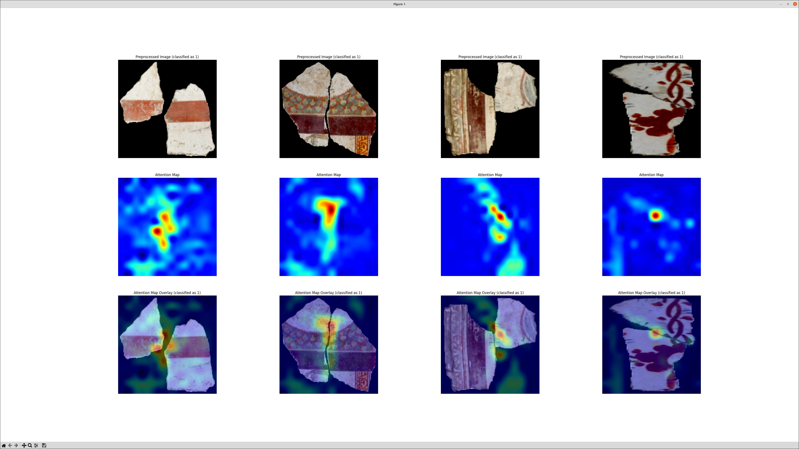|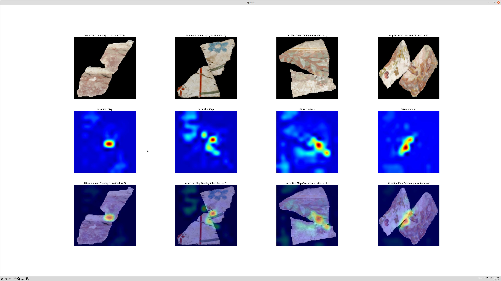|

#### Attention Maps for `ViT v3 slow` model
| Correct Alignments | Wrong Alignments |
|:--------:|:--------:|
|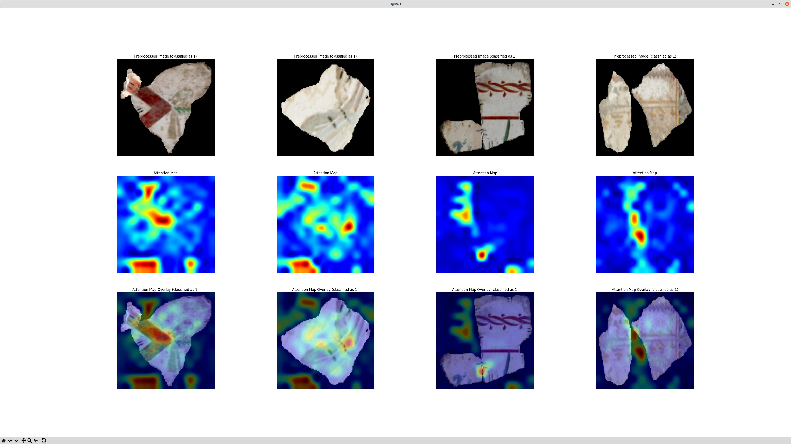|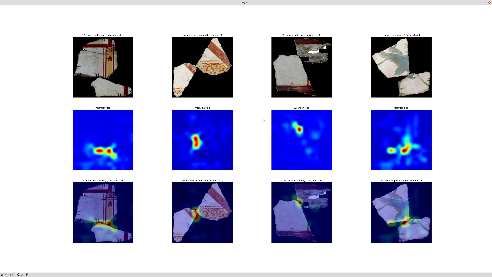|

## Version 2 (14/07):
- Using Hugging Face library (wandb for logging)
- 15 epochs, `training_batch_size=64`
- Use `AdamW` as optimizer (`pytorch` implementation)
- Data Augmentation using [Albumentationsx](https://github.com/albumentations-team/AlbumentationsX)
- Attention Map visualization
- Tried `large` google ViT model

**Scripts:**
- `train_with_transformers.py` (trains using the `transformers` library from hugging face)
- `show_attention_map.py` (visualizes the attention map)
- `evaluate_with_transformers.py` (for the metrics)

#### Performance
The wandb logger says:

| Model Type | Model Size | Accuracy | Loss | Runtime | Samples per second |
|:----------:|:----------:|:--------:|:----:|:-------:|:------------------:|
| ViTForImageClassification | base | 0.93136 | 0.22247 | 30.105 | 66.301 |
| ViTForImageClassification | large | 0.93287 | 0.23156 | 52.3623 | 38.119 |

*Note: it is trained starting from "google/vit-base-patch16-224-in21k" or "google/vit-large-patch16-224-in21k"*

#### Issues:
- I am doing double preprocessing (albumentations + AutoImageProcessor)
- evaluation code has some problem when loading the data which I do not understand (visualization works)

#### Attention Maps for `base` model
| Correct Alignments | Wrong Alignments |
|:--------:|:--------:|
|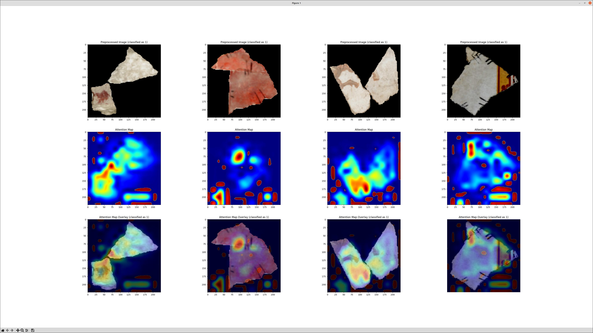|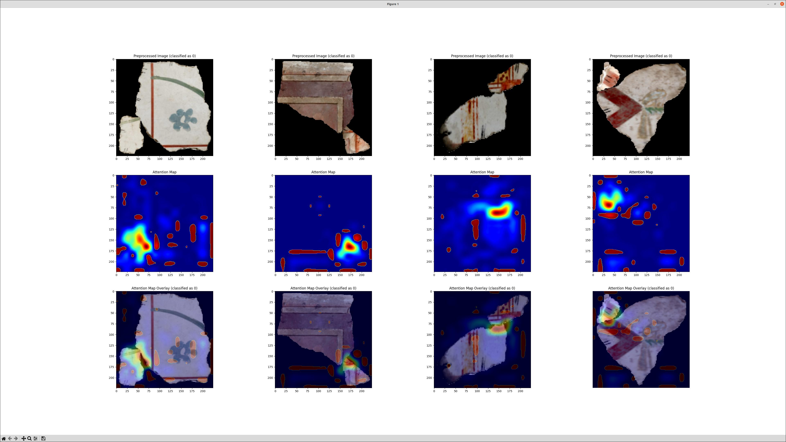|
|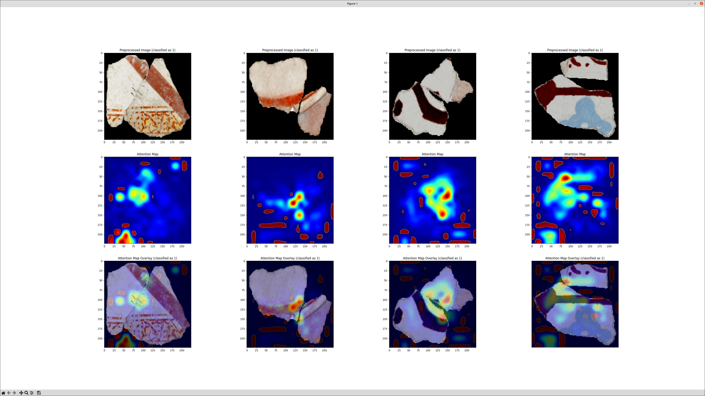|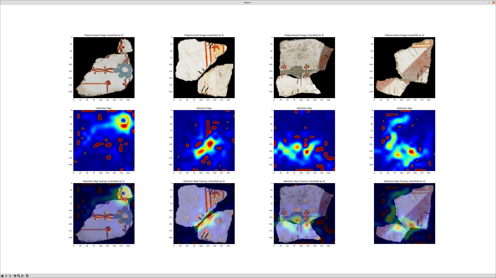|

#### Attention Maps for `large` model
| Correct Alignments | Wrong Alignments |
|:--------:|:--------:|
|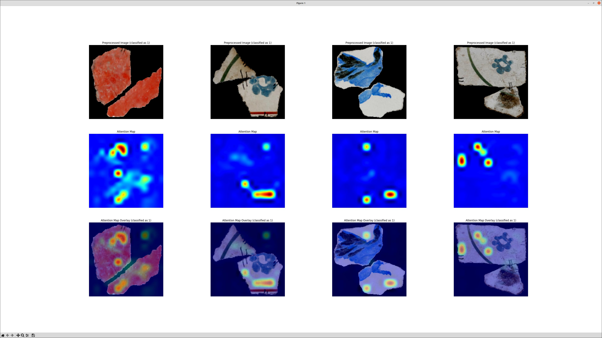|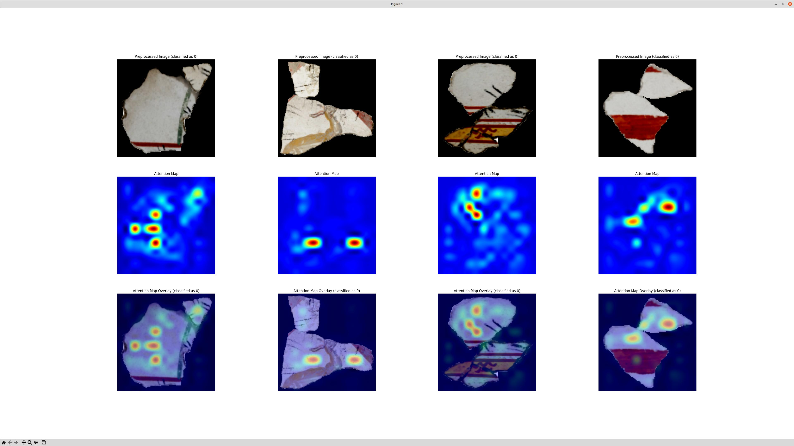|


## Version 1 (11/07):
- basic initialization (no tricks, not studied, no optimization, no masks, no spatial attention)
- 25 epochs each (with early stopping, ResNet did not stop, HF stop after 19, ST after 12)
- Transforms to perform on-the-fly data augmentation (random crop, flip, rotation)

**Scripts:**
- `train.py` (even the HF transformer model is trained using standard pytorch training loop)
- `evaluate.py` (all can be evaluated using the same code)
- `visualize.py` (show the results)

Clear winner: **Transformer using HuggingFace Pretrained ViT**

*Note: It is a transformer-based model using a pretrained feature extractor (from Google) with a classifier on top (sigmoid output layer).*

Examples: 
| Random 8 Images (Validation Set) | Random 8 Images (Validation Set) |
|:--------:|:--------:|
|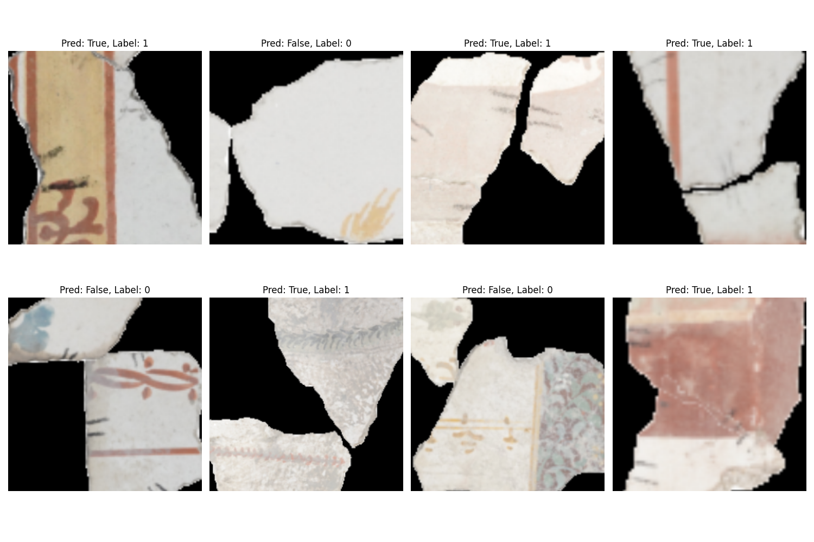|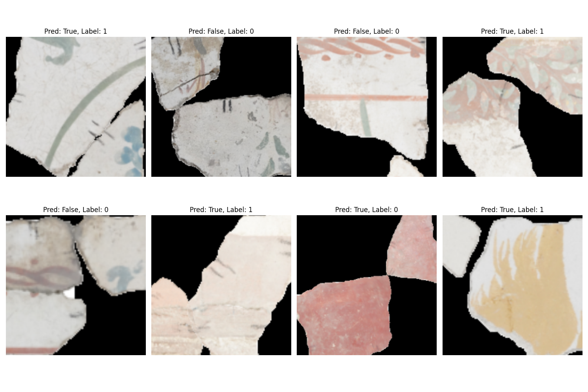|

### Performance with `evaluate.py`

| Model          |      Accuracy |  AUC   |  
|:--------------:|:-------------:|:------:|
| ResNet50              | 0.6889 | 0.7570 |
| SmallTransformer      | 0.6042 | 0.6413 |
| **Transformer (HF)**  | **0.9158** | **0.9684** |

**Confusion Matrix:**

| ResNet  |  T |  F | SmallTransformer | T | F | HuggingFace | T | F |  
|---:|---:|---:|---:|---:|---:|---:|---:|---:|
| P  | 743| 255| P  | 581| 417| P  | 911|  87| 
| N  | 366| 632| N  | 373| 625| N  |  81| 917|

**Note:** I was starting to evaluate on more metrics (to get false positive and so on), but I might need to fix precision/recall/f1 code (auc is from scikit-learn), so for now accuracy and AUC seems to me the only reliable ones. 

| Model          |      Accuracy | Precision | Recall |  F1    |  AUC   |  
|:--------------:|:-------------:|:---------:|:------:|:------:|:------:|
| ResNet50              | 0.6889 | 0.6889    | 0.3111 | 0.4287 | 0.7570 |
| SmallTransformer      | 0.6042 | 0.6042    | 0.3958 | 0.4783 | 0.6413 |
| **Transformer (HF)**  | **0.9158** | **0.9158** | **0.0842** | **0.1542** | **0.9684** |


### Visualization

#### ResNet50
| ResNet50 (Training Set) | ResNet50 (Validation Set) |
|:--------:|:--------:|
|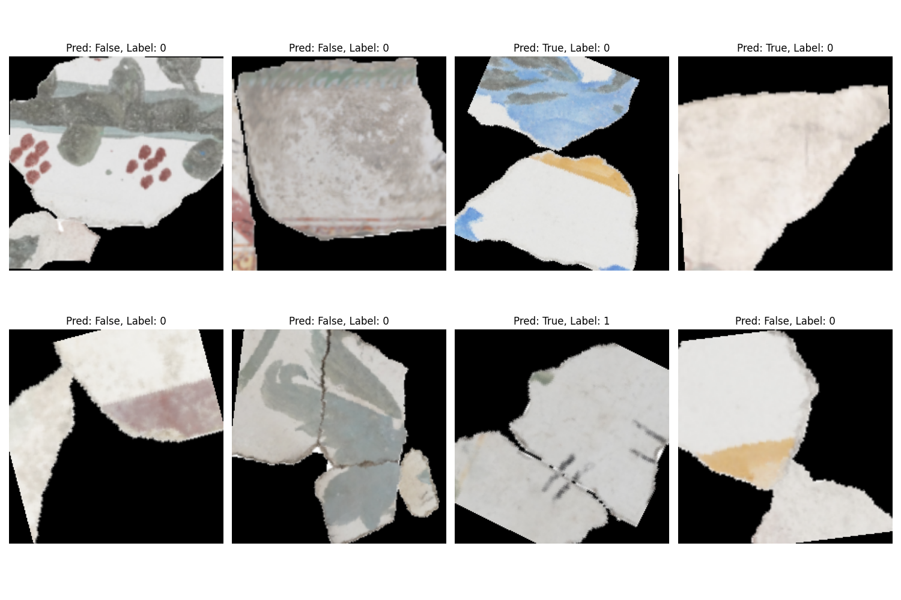|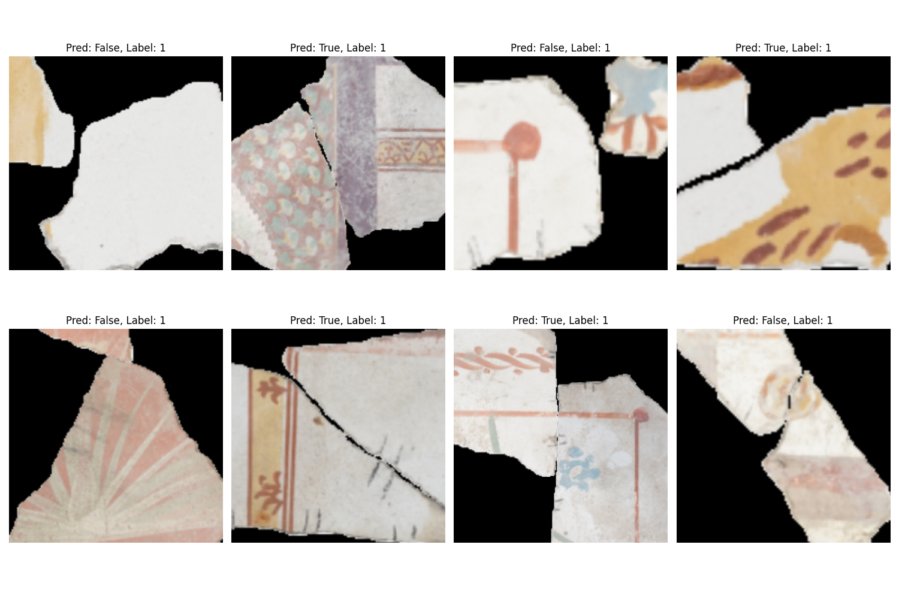|

#### SmallTransformer (PT)
| SmallTransformer (PT) (Training Set) | SmallTransformer (PT) (Validation Set) |
|:--------:|:--------:|
|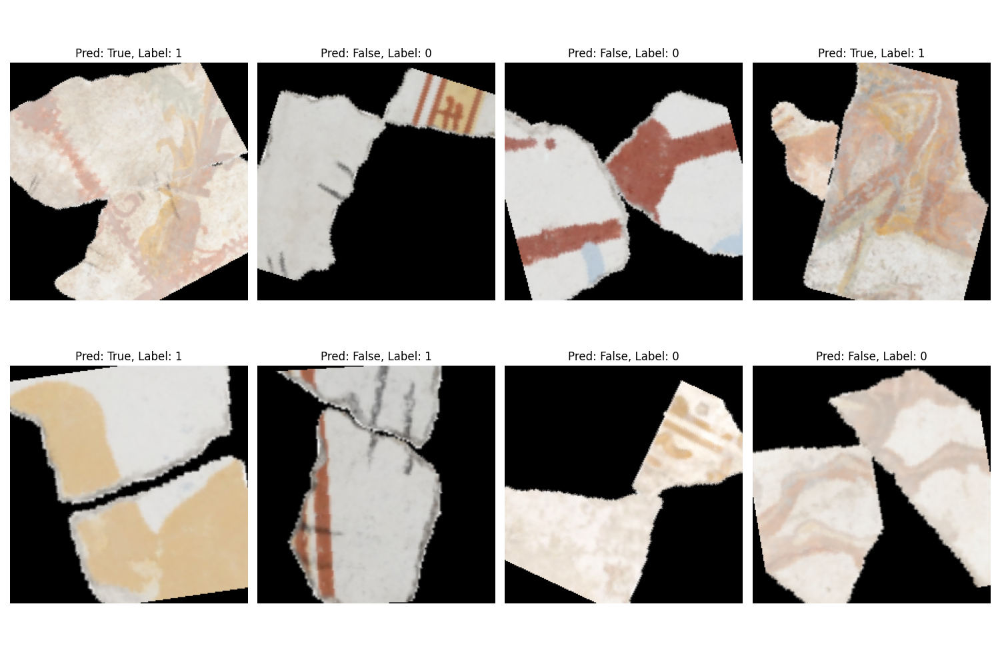||


#### Transformer (HF)
| Transformer (HF) (Training Set) | Transformer (HF) (Validation Set) |
|:--------:|:--------:|
|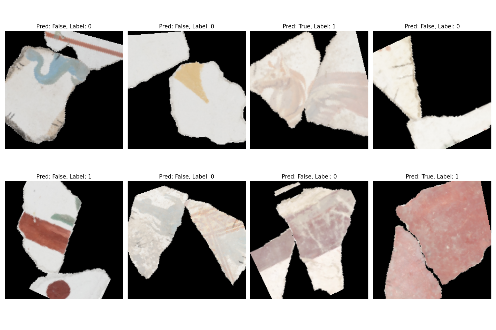||

**Note:** the validation set was not shuffled, so all the *correct* images are at the front (that's why you see only label 1 in the visualization, you can use `visualize.py` to get random results)

#### Performance during Training

|   Model   | Train Acc. | Val Acc. | Train Loss | Val Loss |
|:---------:|:----------:|:--------:|:----------:|:--------:|
| ResNet50 (Pytorch)            | 67% | 69% | 0.61 | 0.59 |
| SmallTransformer (Pytorch)    | 61% | 59% | 0.66 | 0.67 |
| **Transformer (HuggingFace)** | **92%** | **90%** | **0.18** | **0.24** |

